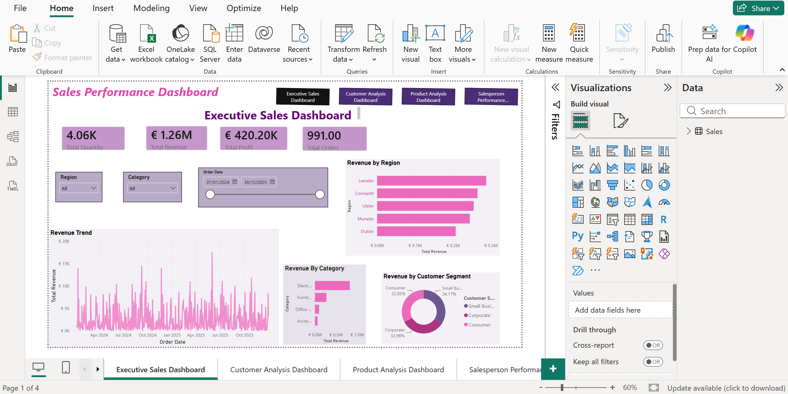
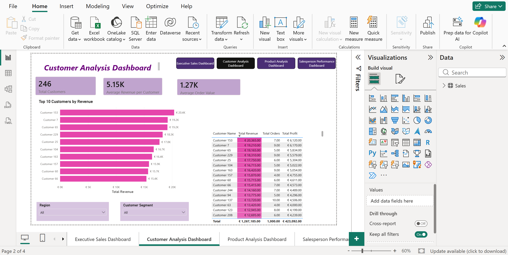
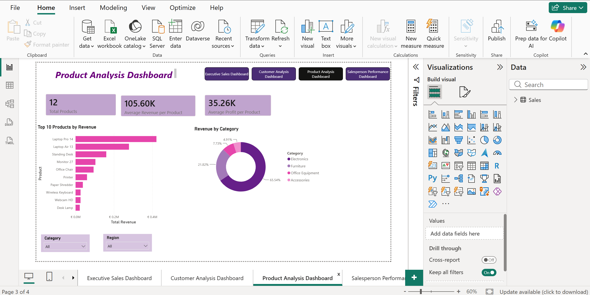
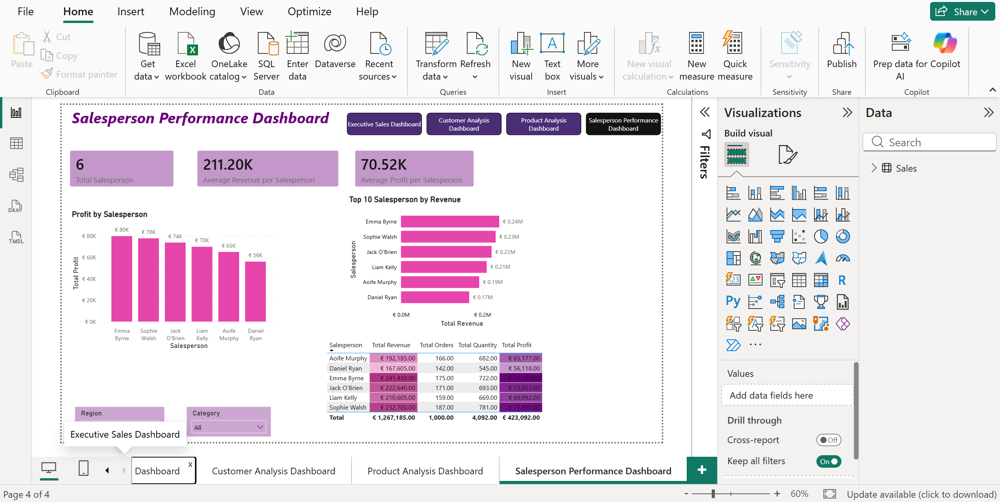

# 📊 Sales Performance Dashboard

An interactive Business Intelligence dashboard built using **Power BI** to analyse sales performance across regions, customers, products, and salespeople.

---

# 📌 Project Overview

This project is an interactive Sales Performance Dashboard built using **Power BI**. It provides valuable business insights by analysing sales trends, customer behaviour, product performance, and salesperson performance through interactive visualisations and KPIs.

The dashboard enables decision-makers to quickly identify top-performing regions, customers, products, and salespeople while monitoring overall business performance.

---

# 🛠️ Tools & Technologies

- Power BI
- Power Query
- DAX
- Microsoft Excel

---

# 📈 Dashboard Pages

## 1. Executive Sales Dashboard

- Total Revenue
- Total Profit
- Total Orders
- Total Quantity
- Revenue Trend
- Revenue by Region
- Revenue by Category
- Revenue by Customer Segment

## 2. Customer Analysis Dashboard

- Total Customers
- Average Revenue per Customer
- Average Order Value
- Top Customers by Revenue
- Customer Performance Table

## 3. Product Analysis Dashboard

- Total Products
- Average Revenue per Product
- Average Profit per Product
- Top Products by Revenue
- Revenue by Category

## 4. Salesperson Performance Dashboard

- Total Salespeople
- Average Revenue per Salesperson
- Average Profit per Salesperson
- Top Salespeople by Revenue
- Salesperson Performance Table

---

# 📊 Key KPIs

- Total Revenue
- Total Profit
- Total Orders
- Total Quantity
- Average Order Value
- Revenue by Region
- Revenue by Category
- Customer Performance
- Product Performance
- Salesperson Performance

---

# 📌 Business Questions Answered

- Which region generates the highest revenue?
- Which customer contributes the most revenue?
- Which product category performs best?
- Which products generate the highest sales?
- Which salesperson generates the highest revenue and profit?
- How do different customer segments contribute to overall sales?
- What are the overall sales and profit trends?

---

# 💡 Skills Demonstrated

- Data Cleaning using Power Query
- Data Transformation
- Data Modelling
- DAX Measures
- KPI Development
- Interactive Dashboard Design
- Business Intelligence Reporting
- Data Visualisation
- Slicers & Filters
- Dashboard Navigation

---

# 🎯 Project Outcome

This dashboard enables business users to monitor sales performance, identify trends, evaluate customer and product performance, and measure salesperson effectiveness through interactive reports.

---

# 📷 Dashboard Preview

## Executive Sales Dashboard

---

## Customer Analysis Dashboard

---

## Product Analysis Dashboard

---

## Salesperson Performance Dashboard

---

# 📁 Files Included

- Sales Performance Dashboard.pbix
- Sales_Performance_Dataset.xlsx

---

# 👩‍💻 Author

**Joyce De Souza**

Aspiring Data Analyst

**Skills:** Power BI • SQL • Excel • Power Query • DAX

GitHub: https://github.com/joycedsouza2510-wq
